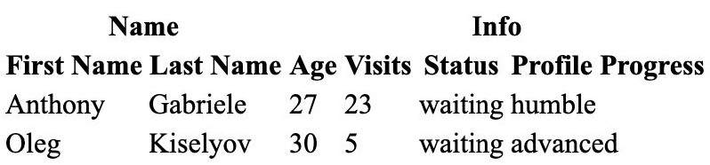

# tree-to-grid

## installation

```
yarn add tree-to-grid
```

## example (react)

Example is adapted from [react-table](https://codesandbox.io/s/github/tannerlinsley/react-table/tree/master/examples/basic?from-embed)

```tsx
import React from 'react';
import { Tree, branchValueGrid, leafValues } from 'tree-to-grid';

type ValueOf<A> = A[keyof A]

interface Group<A> {
  Header: string
  columns: Column<A>[]
}
type Accessor<A> = ValueOf<{
  [K in keyof A]: {
    Header: string
    accessor: K
    Cell?: (val: A[K]) => React.ReactNode
  }
}>
type Column<A> = Group<A> | Accessor<A>

const toTree = <A,>(col: Column<A>): Tree<Accessor<A>, string> => 'columns' in col
  ? {
    type: 'Branch',
    value: col.Header,
    children: col.columns.map(toTree)
  }
  : {
    type: 'Leaf',
    value: col
  }

const Table = <A,>({ data, columns }: { data: A[]; columns: Column<A>[] }) => {
  const accessors = columns.map(toTree).flatMap(leafValues)
  return (
    <table>
      <thead>
        {branchValueGrid(columns.map(toTree)).map(headerGroup => (
          <tr>
            {headerGroup.map(({ value, numLeaves }) => (
              <th colSpan={numLeaves}>{value}</th>
            ))}
          </tr>
        ))}
        <tr>
          {accessors.map(({Header}) => <th>{Header}</th>)}
        </tr>
      </thead>
      <tbody>
        {data.map(rowData => (
          <tr>
            {accessors.map(({Cell = (a) => a, accessor}) => (
              <td>{Cell(rowData[accessor])}</td>
            ))}
          </tr>
        ))}
      </tbody>
    </table>
  )
}

interface User {
  firstName: string
  lastName: string
  age: number
  visits: number
  status: string
  progress: string
}
const App = () => {
  const columns: Column<User>[] = [
    {
      Header: 'Name',
      columns: [
        { Header: 'First Name', accessor: 'firstName' },
        { Header: 'Last Name', accessor: 'lastName' },
      ],
    },
    {
      Header: 'Info',
      columns: [
        { Header: 'Age', accessor: 'age' },
        { Header: 'Visits', accessor: 'visits' },
        { Header: 'Status', accessor: 'status' },
        { Header: 'Profile Progress', accessor: 'progress' },
      ],
    },
  ]
  const data: User[] = [
    {
      firstName: 'Anthony',
      lastName: 'Gabriele',
      age: 27,
      visits: 23,
      status: 'waiting',
      progress: 'humble'
    },
    {
      firstName: 'Oleg',
      lastName: 'Kiselyov',
      age: 30,
      visits: 5,
      status: 'waiting',
      progress: 'advanced'
    }
  ]
  return <Table columns={columns} data={data} />
}
```

### output

